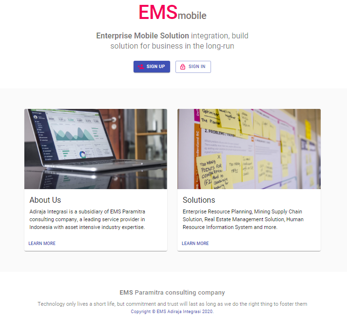

# Mock-up EMS Version 2.1.0
Mock-up App. for integrate to existing system

## Owner of Application
This application owned by [PT. Adiraja Integrasi](https://adiraja-integrasi.com/)
> DO NOT use this application without any permit from PT. Adiraja Integrasi

## PT. Adiraja Integrasi

### About
"Through years of experience, Adiraja has developed & implemented various proven solutions with real value added services to companies!",
[Contact](https://adiraja-integrasi.com/contact-us/)

### Solutions
- Enterprise Software - [More info](https://adiraja-integrasi.com/enterprise-software/)
- Software Development - [More info](https://adiraja-integrasi.com/services/software-development/)
- Big Data Analytics - [More info](https://adiraja-integrasi.com/products/big-data-analytics/)
- Digital Office (Saas) - [More info](https://adiraja-integrasi.com/digital-office-saas/)
 
## Screenshot

  

## Author
> Eka Prasetia

